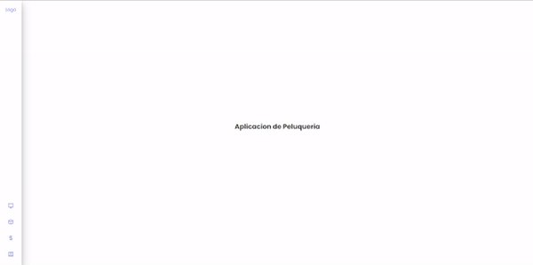
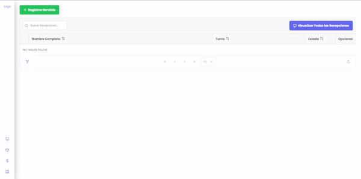

# Aplicacion de Peluqueria
Este repositorio alberga el código fuente de una aplicación de gestión de peluquería que incluye módulos clave como Recepción, Inventario, Gastos y Reportes. Nuestra aplicación simplifica la gestión de citas, seguimiento de inventario, control de gastos y generación de informes, proporcionando una solución integral para ayudarte a administrar tu salón de belleza de manera eficiente y efectiva. Optimiza tus operaciones y toma decisiones basadas en datos con esta aplicación diseñada específicamente para el sector de la peluquería.




## Pasos de Inicializacion
Antes de realizar el primer comando primero asigna la ruta de la base de datos, del contario te dara error, tambien tener en cuenta los permisos del directorio donde asignes la base de datos.
```
npm prisma db push
npm install
npm run dev
```

## Informacion Principal
| Funcionalidad | Descripcion |
|----------|----------|
| Recepcion    | Este módulo se encarga de gestionar y supervisar el proceso de recepción de clientes, basandose en los servicios de tu sistema.   |
| Inventario    | El módulo de inventario en Cell 5 es fundamental para mantener un registro preciso de todos los productos, materiales o activos disponibles.   |
| Gastos    | El módulo de gastos se encarga de rastrear y controlar los gastos relacionados con tus productos. Permite registrar, eliminar y modificar.   |
| Reportes    | Generar informes y análisis detallados sobre diferentes aspectos de tu negocio o sistema. |

## Herramientas Utilizadas:


